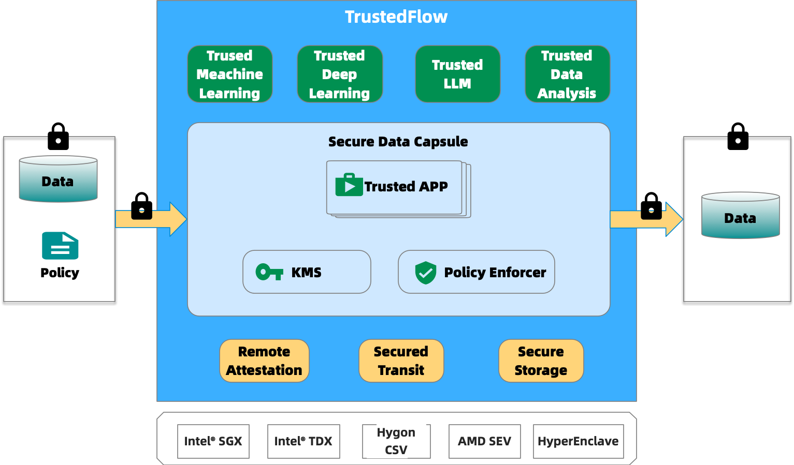

<a href="./README.zh-CN.md">简体中文</a>｜<a href="./README.md">English</a>

## What's TrustedFlow

**TrustedFlow** is a zero-trust computing system based on TEE(Trusted Execution Environments). TrustedFlow derives its name from the fusion of **Trusted** Execution environments and **Secret**Flow. 

TrustedFlow leverages trusted execution environment technology to establish a secure and isolated environment that safeguards sensitive data. With a focus on data confidentiality, integrity, and availability, TrustedFlow provides robust data storage and processing capabilities.

By employing encryption and utilizing controlled and restricted environments, TrustedFlow ensures protection against unauthorized access. It incorporatesa range of security measures, such as remote authentication, computational isolation, authorization controls, and auditing mechanisms to provide comprehensive data protection. The implementation of end-to-end encryption enhances its zero-trust security features, allowing encryption mechanisms to be validated and limiting data access to the absolute minimum permissions required.

In addition to its strong security features, TrustedFlow offers a diverse array of data processing functionalities. These include data preprocessing, classical machine learning, deep learning, large language modeling, and data analysis. These capabilities empower organizations to maximize the value of their data while preserving privacy.

TrustedFlow is especially valuable in scenarios that involve secure storage, processing, or sharing of sensitive data, as it effectively mitigates the risks associated with data exposure and unauthorized usage. Its comprehensive security measures and powerful data processing capabilities make it a reliable solution for organizations seeking to protect their data and make the most of its potential.

## Documentation

- [TrustedFlow](https://www.secretflow.org.cn/docs/trustedflow/zh_CN/)

## TrustedFlow Related Projects

- [CapsuleManager](https://github.com/secretflow/capsule-manager): authorization and key management module.
- [TEEAPPs](https://github.com/secretflow/teeapps): trusted applications.
- [CapsuleManagerSDK](https://github.com/secretflow/capsule-manager-sdk): the CLI tool and sdk for CapsuleManager.

## Roadmap

[roadmap](./docs/advanced_topic/roadmap.md)