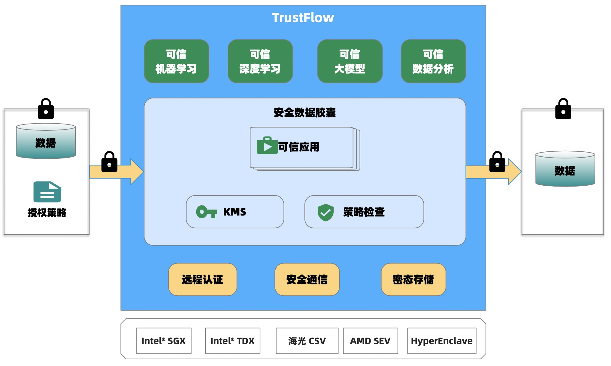

<a href="./README.zh-CN.md">简体中文</a>｜<a href="./README.md">English</a>

## TrustFlow

可信执行环境(Trusted Execution Environment，TEE) 是一种基于硬件的隐私保护技术。它保证了执行代码的真实性，运行时状态(如寄存器、内存和敏感I/O)的完整性，以及存储在内存中的代码、数据和运行时状态的机密性。此外，还应能够向第三方提供远程认证，以证明其可靠性。

**TrustFlow**是隐语基于可信硬件的隐私计算引擎。TrustFlow立足于可信执行环境技术，提供受保护和隔离的环境，其中封装了敏感数据，并且提供数据安全存储和处理能力。TrustFlow可以保护数据的机密性、完整性和可用性。

在TrustFlow中，数据被加密并存储在受控环境中，以防止未经授权访问。TrustFlow采用多种安全措施，如远程认证、计算隔离、授权管控和审计机制，以确保数据被正确保护。TrustFlow具有端到端全链路加密能力，提供了零信任（Zero-Trust）安全特性，机构可以对TrustFlow进行验证，限制数据使用最小权限访问。

与此同时，TrustFlow提供了丰富的数据加工处理能力，包括数据预处理、经典机器学习、深度学习、大模型、数据分析等，在保护数据隐私的同时可以充分释放数据价值。

TrustFlow可用于需要安全存储、处理或共享敏感数据的场景，以最大程度地减少暴露或未经授权使用的风险。

## 文档

- [TrustFlow](https://www.secretflow.org.cn/docs/trustflow)

## 关联的代码仓库

- [CapsuleManager](https://github.com/asterinas/trustflow-capsule-manager): 授权和密钥管理模块。
- [TEEAPPs](https://github.com/asterinas/trustflow-teeapps): 可信应用。
- [CapsuleManagerSDK](https://github.com/asterinas/trustflow-capsule-manager-sdk): CapsuleManager的命令行工具和SDK。

## 路线图

[roadmap](./docs/advanced_topic/roadmap.md)