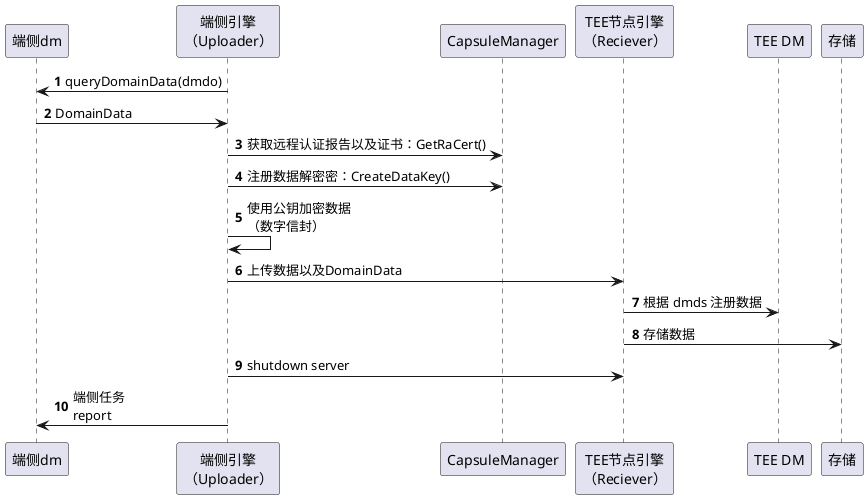

# Data management component

数据管理组件是对 capsule-mananger-sdk 的封装，用于实现对用户数据的处理：包括数据加密上传，数据授权，数据删除，授权取消以及数据导出。并且需要在 Kusica 上部署才可以正常运行。

## Quick Start
```
python main.py --task_config_path /etc/kuscia/task_config.conf
```
## 详细设计

### 数据上传
数据上传的时序图如下，数据上传是一个两方算子，uploader 需要在本地加密文件，在请求 receiver 接受数据。

在实现上程序入口都是从 `main.py` 开始，如果是 uploader，那么后续执行的逻辑仍然基于 python 实现；如果是 recevier 则会单独拉起一个 Http Server 用于接受请求。 Http Server 在数据上传过程使用到两个接口：第 6 步中的数据上传接口，以及第 9 步的 shutdown 接口，用于正常退出: 

upload 接口用于上传数据，需要指定本地上传文件的本地路径`file`，在 recevier 端上注册数据的位置`store_path`, 以及数据的meta数据 `domain_data`:
```
curl -F  file=@localfile \
         store_path=dm://output?datasource_id=default-data-source&id=alice-table&uri=alice-table.encrypted   \
         domain_data=""    \
         http://localhost/upload

```

shutdown 接口用于让 server 正常退出，因为 uploader 可能会多次重试上传数据，只有当 uploader 需要 shutdown server 的时候，进程才会退出。
```
curl -X POST http://localhost/shutdown
```


**注意：算子因为假设运行在 kuscia 的框架之下，鉴权相关部分依赖 kuscia，算子不会有相关设计**

