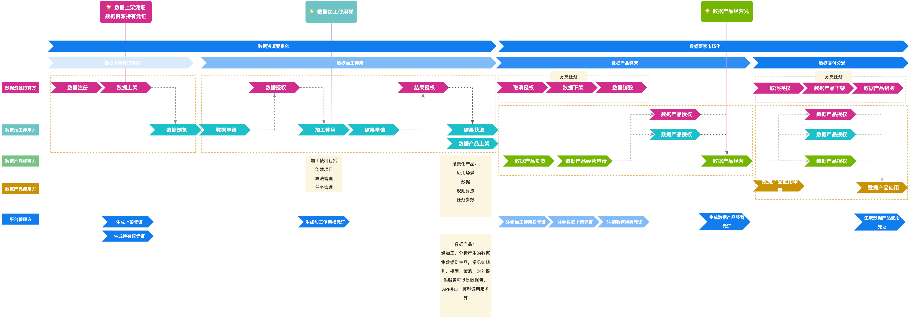
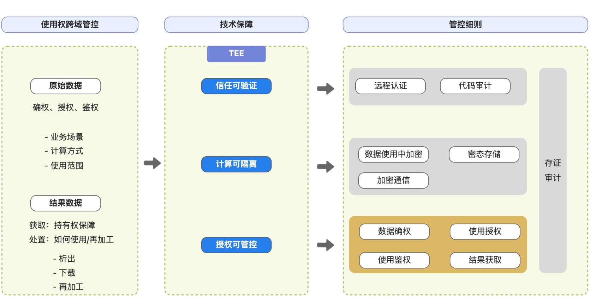
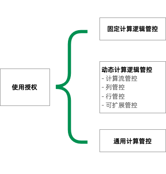

# 基于TrustFlow的数据要素跨域管控

## 数据要素和三权分置

放眼全球，新一轮科技革命和产业变革深入发展，互联网、大数据、云计算、人工智能、区块链等数字技术创新活跃，数据作为关键生产要素的价值日益凸显，深入渗透到经济社会各领域全过程，数字化转型深入推进，传统产业加速向智能化、绿色化、融合化方向转型升级，新产业、新业态、新模式蓬勃发展，推动生产方式、生活方式发生深刻变化，数字经济成为重组全球要素资源、重塑全球经济结构、改变全球竞争格局的关键力量。
数据作为新型生产要素，是数字化、网络化、智能化的基础，已快速融入生产、分配、流通、消费和社会服务管理等各环节，深刻改变着生产方式、生活方式和社会治理方式。

- 2019年10月，中央在19届4中全会上首次提出数据是一种生产要素，明确要求“健全劳动、资本、土地、知识、技术、管理、数据等生产要素由市场评价贡献、按贡献决定报酬的机制。
- 2020 年 4 月 9 日，中共中央国务院发布《关于构建更加完善的要素市场化配置体制机制的意见》，在传统的要素之外，文件还把数据纳入了生产要素的范围，成为数字化转型带动中国新经济发展的坚实政策基础。
- 2022年12月发布的《中共中央 国务院关于构建数据基础制度更好发挥数据要素作用的意见》（后续简称“数据二十条”）从数据产权、流通交易、收益分配、安全治理四方面，提出二十条政策举措。旨在充分发挥我国海量数据规模和丰富应用场景优势，激活数据要素潜能，做强做优做大数字经济，增强经济发展新动能。

现实中数据采集、利用等环节存在权益保障、隐私保护、安全合规等难题，法律法规是解决数据流通的基础，在此基础上，还需要探索更多的技术手段保障数据流通的安全，促进数据价值的释放。

### 数据要素三权分置

“数据二十条”开创性提出了“数据资源持有权、数据加工使用权、数据产品经营权”的三权分置模式。 关于三权分置的数据产权制度细则并未出台，业界对于三权定义尚不清晰，综合考虑“数据二十条”及其他相关文件，我们对数据资源持有权、数据加工使用权、数据产品经营权的三权分置概念解释如下。
定义的参考资料见文末附录。

#### 数据资源持有权

数据资源持有权相当于弱化或改造的“所有权”，其客体是数据资源，其主体是数据来源者或数据处理者。
- 在具体权能上，数据的持有者不仅有权进行数据处理，同时也可以经由其同意来“转让”自己对数据的持有权利（如数据加工使用权、数据产品经营权）。
- 在权力来源上，“数据二十条”中指出数据资源持有权可以分为数据来源者持有自己所产生的数据和数据处理者“依法持有”（如通过委托授权）其他主体（数据来源者）的数据。此外，数据资源持有权也存在相应的限制，不得超出或法律规定的权限（如来源合规等）。	

#### 数据加工使用权
数据加工使用权是依法加工处理和使用数据的权力，其客体是数据资源或者数据产品，其主体是数据处理者。
- 在具体的权能上，数据加工包括对数据进行清洗、预处理、分析、建模等处理的活动。
- 在权力来源上，在满足“依法持有”或“合法取得”数据的前提下，数据处理者即拥有数据加工使用权。依法持有表示数据来源者依法采集、数据持有者依法持有，合法取得表示按照合同约定。

#### 数据产品经营权
数据产品经营权指对数据处理者开发的数据产品进行经营、交易并获取收益的权益，其客体是数据产品，其主体是数据处理者。
在具体的权能上，数据产品经营权包括收益权和经营权。
在权力来源上，数据产品经营权来源于数据处理者通过大量智力和体力劳动赋予了数据更高的价值。数据产品的形成是以“实质性加工”和“创新性劳动”为前提。

#### 三权分置下的数据流转

## 数据使用权跨域管控

随着数据要素的流转，数据离开持有者的“运维域/管理域”后，如何保障数据使用权依然受到管控是新的挑战。如果数据使用权跨域得不到管控，那么数据流通的安全得不到保障，进一步会阻碍数据的流通。这催生了使用权跨域管控的需求。
所谓的管控，主要是指对数据的管控，包括：
- 对原始数据的管控：如何使用。包括但不限于数据注册、加密上传、授权、取消授权、计算、销毁等。
- 对结果数据的管控：获取及使用。包括结果的查看、下载、再加工使用等。

通过合作协议和法律法规对数据使用权进行管控是基本方式。在此基础上，我们希望通过技术提供更可靠更高级的保障，让数据使用权的管控不只是依赖于人治，基于技术的信任，会更加有助于数据要素的流通和三权分置。

## 为什么使用TrustFlow保障使用权跨域管控？
如何保障使用权跨域管控是数据要素流通中的挑战，这既需要法规授权作为基础，也需要有效的技术进行保障。通过依法授权获得数据使用权限，通过技术保障数据不被泄露和滥用。
TrustFlow是隐语基于可信执行环境（Trusted Execution Environment，简称TEE）的可信计算系统，具有可信可验证、计算可隔离、授权可管控等机制，强有力的保障了数据要素流通中的使用权跨域管控。

## TrustFlow使用权跨域管控
TrustFlow以TEE作为技术底座，提供了信任可验证、计算可隔离、授权可管控三大核心特性以保障数据要素流通过程中的使用权跨域管控。此外TrustFlow提供了丰富的人工智能和数据分析计算能力，在充分保障数据使用权的同时释放数据要素的价值。

### 信任可验证
通过TEE的远程认证机制，可以对TrustFlow运行环境、运行的代码进行验证，确保TrustFlow运行在正确的可信执行环境中，且代码符合预期没有被篡改。
TrustFlow会尽量以最新安全手段对代码进行加固，TrustFlow代码是开源的，用户亦可以对代码进行安全审计。

### 计算可隔离
TrustFlow覆盖了数据使用中（data-in-use）、数据存储（data-at-rest）、数据传输（data-in-transit）端到端全链路的安全保障。TrustFlow保证了数据在流转全链路中一直保存密态，是名副其实的全链路密态计算系统。

1. 数据使用中（data-in-use）加密

    基于TEE的内存加密、内存隔离等安全特性，TrustFlow在数据在使用过程中保证数据一直处于加密状态。

2. 数据存储（data-at-rest）加密

    TrustFlow向外部存储（比如硬盘、网络存储等）写入数据前，会对数据进行加密，且密钥仅TrustFlow可访问。

3. 数据传输（data-in-transit）加密

    TrustFlow基于TEE的远程认证机制建立安全通道（比如mTLS），确保TrustFlow内部数据传输以及外部数据传输的完整性与机密性。

### 授权可管控
TrustFlow提供了一套完善的授权管控机制，包含数据确权、使用授权、使用鉴权、结果获取等。在信任可验证的基础上，机构可以对TrustFlow进行验证，从而确保TrustFlow授权管控机制一定是按照预期运行，这也是TrustFlow相比传统管控方案（比如需要依赖相信管控方）的一大优点。

#### 数据确权
针对数据确权，TrustFlow提供了可信的数据属主和数据标识能力。

数据属主：TrustFlow中的数据均有数据持有方的签名和完整性保护，确保数据持有方与数据实体的绑定关系可信。

数据标识：TrustFlow中的数据均有ID标识，并且具有完整性保护，确保数据实体与ID之间的绑定关系可信。

#### 使用授权
使用授权指的是数据持有方可以对数据进行细粒度的管控，加工使用方只有获得正确授权才能对数据进行指定的计算和加工。
针对使用授权，TrustFlow提供了固定计算逻辑、动态计算逻辑和通用计算限制等管控，TrustFlow提供了一套语法用于描述授权策略，其详细原理可以参考[授权策略](../architecture/policy.md)。

1. 固定计算逻辑

    数据持有方可以限制数据仅能执行固定计算逻辑，比如数据仅能被用于统计平均值。

2. 动态计算逻辑

    在有些场景下，固化的数据计算逻辑可能不适合。比如在AI场景下，数据可能需要经过清洗、预处理、建模、评估等流程才能发挥数据的价值，算法人员可能需要对数据进行反复试验才能获得较好的模型，这意味需要动态计算逻辑。

    针对此类场景，TrustFlow提供了以下管控能力：

    - 动态计算流管控

        数据持有方可以限制数据只能在有限的算法下进行计算，数据只有在计算逻辑在授权的算法列表中时才能进行计算。
    - 列管控

        对于结构化数据，数据持有方可以限制仅能使用数据的部分列，还可以进一步限定数据列可以进行的计算操作操作，比如仅能做聚合计算、仅能求平均值等。对于数据分析场景而言，可以在便利数据使用方分析的同时确保数据不被滥用。
    - 行管控

        对于结构化数据，数据持有方可以限制仅能使用数据的部分行，比如限制仅可使用数据的前100条。
    - 可扩展管控

        TrustFlow提供了一套可扩展的授权语法，可以按照机构对计算参数做进一步的限制，比如可以限定数据必须经过差分隐私（Differential Privacy）处理且ε必须等于某个值。

3. 通用计算限制

    除了固定计算逻辑和动态计算逻辑外，TrustFlow还允许数据持有方对数据进行一些通用限制，比如限制数据可被计算次数、设置数据过期时间、指定数据计算参与方等。

#### 使用鉴权
使用鉴权是指实际执行计算时，对授权策略进行校验。TrustFlow在执行计算代码时，会对计算代码（逻辑）、计算参数、计算限制等各项内容根据授权策略进行强制检查，具体原理可以参考[TrustFlow原理](../architecture/principle.md)。

#### 结果获取
获取数据加工的结果需要被管控，这里需要保障两件事，一是结果数据的可信性，即结果数据是按照预期加工方式进行的，二是谁可以获得结果数据。

##### 数据溯源
TrustFlow提供了数据溯源机制，数据加工使用方可以通过数据溯源确认结果数据是按照预期的计算逻辑产生，确保结果数据没有被仿冒或者篡改。TrustFlow的数据血缘机制可以参考[数据血缘](../architecture/data_lineage.md)。

##### 授权获取
TrustFlow提供了结果数据的授权审批机制，任何参与方想要获取结果数据必须得到全体数据持有方的同意，详细原理可以参见[获取结果](../quick_start/step5.ipynb)。

## 附录
### 数据要素三权分置的定义

数据要素三权分置的定义主要参考自《数据二十条》。

> 以下摘自《数据二十条》

数据来源者：促成产生数据的主体，如个人、企业/机构
数据来源者定义参考：“数据二十条”原文：
> （七）建立健全数据要素各参与方合法权益保护制度。充分保护数据来源者合法权益，推动基于知情同意或存在法定事由的数据流通使用模式，保障数据来源者享有获取或复制转移由其促成产生数据的权益。合理保护数据处理者对依法依规持有的数据进行自主管控的权益。在保护公共利益、数据安全、数据来源者合法权益的前提下，承认和保护依照法律规定或合同约定获取的数据加工使用权，尊重数据采集、加工等数据处理者的劳动和其他要素贡献，充分保障数据处理者使用数据和获得收益的权利。保护经加工、分析等形成数据或数据衍生产品的经营权，依法依规规范数据处理者许可他人使用数据或数据衍生产品的权利，促进数据要素流通复用。建立健全基于法律规定或合同约定流转数据相关财产性权益的机制。在数据处理者发生合并、分立、解散、被宣告破产时，推动相关权利和义务依法依规同步转移。

> 以下摘自《数据二十条》

数据处理者：对原始数据进行开发利用、依规行使数据应用相关权利的主体。包括数据持有者、数据加工者、数据使用者等
数据处理者定义参考：“数据二十条”原文：
> （三）在保障安全前提下，推动数据处理者依法依规对原始数据进行开发利用，支持数据处理者依法依规行使数据应用相关权利，促进数据使用价值复用与充分利用，促进数据使用权交换和市场化流通。审慎对待原始数据的流转交易行为
> （七）合理保护数据处理者对依法依规持有的数据进行自主管控的权益。在保护公共利益、数据安全、数据来源者合法权益的前提下，承认和保护依照法律规定或合同约定获取的数据加工使用权，尊重数据采集、加工等数据处理者的劳动和其他要素贡献，充分保障数据处理者使用数据和获得收益的权利。

> 以下摘自《数据二十条》

数据产品：经加工、分析等形成数据或数据衍生产品，包括但不限于数据包、模型、API接口等
数据产品定义参考：“数据二十条”原文：
> （四）鼓励公共数据在保护个人隐私和确保公共安全的前提下，按照“原始数据不出域、数据可用不可见”的要求，以模型、核验等产品和服务等形式向社会提供，对不承载个人信息和不影响公共安全的公共数据，推动按用途加大供给使用范围。
> （七）保护经加工、分析等形成数据或数据衍生产品的经营权，依法依规规范数据处理者许可他人使用数据或数据衍生产品的权利

其他：
> 《上海市数据条例》第四十九条规定，鼓励深度挖掘数据价值，通过实质性加工和创新性劳动形成数据产品和服务。
> 《上海市公共数据开放实施细则》第二十条规定，支持数据利用主体对开放数据进行实质性加工和创造性劳动后形成的数据产品依法进入流通交易市场。