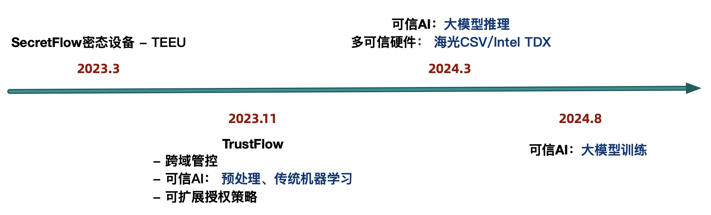

# 路线图

## 功能列表

|大类|小项|是否支持|
|-----|----|----|
|跨域管控|数据密态存储|✅|
||计算管控 - 静态计算逻辑|✅|
||计算管控 - 动态计算逻辑|✅|
||计算管控 - 计算时间|(计划中)|
||计算管控 - 计算次数|(计划中)|
||计算管控 - 列管控(CCL)|(计划中)|
||结果管控 - 导出审批|✅|
||结果管控 - 数据血缘|✅|
||结果管控 - 计算代码血缘|(计划中)|
|可信AI|预处理|✅|
||传统ML|✅|
||深度学习|(计划中)|
||大模型|(计划中)|
|可信BI||(计划中)|

## 路线图

