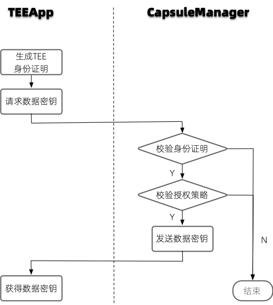

可信APP
========================
TrustFlow内置了多种可信APP，每一个可信APP在执行计算逻辑之前，会先向CapsuleManager请求数据密钥，具体流程如下图所示。

可信APP使用隐语组件标准 `component spec <https://www.secretflow.org.cn/docs/spec/latest/zh-Hans/intro#component>`_ 进行定义。

每个组件包含名称、版本号、属性、输入（inputs）和输出（outputs）。

1. 组件名称由domain + name决定，组件名称通常表示了某一个具体功能的组件。
2. 组件版本号（version）标识了组件的版本，需要注意，不同版本可能兼容也可能不兼容，具体应该见组件说明。
3. 属性（attrs）定义了算子的参数以及它们的默认值、取值范围或者可选值等。
4. 输入（inputs）和输出（outputs）定义了输入输出的类型，用来标识它是一张数据表（table）、一个机器学习的模型（model）还是一个数据分析的报告（report）等。输入输出中的属性（attrs）用来表示该输入输出的额外属性，例如求交算子中用"key"来表示输入表中的求交列，woe分箱算子中用"feature_selects"来表示输入表选取列。

下面，我们会先通过求交和woe分箱这两个可信APP来详细说明组件化定义的方式以及任务配置文件的书写方式。更多的组件示例详见列表。

.. toctree::
   :maxdepth: 1

   intersect
   woe_binning
   woe_substitution
   split
   feature_filter
   corr
   data_describe
   vif
   xgb_train
   lr_train
   xgb_predict
   lr_predict
   lgbm_train
   lgbm_predict
   binary_evaluation
   prediction_bias_eval

   

