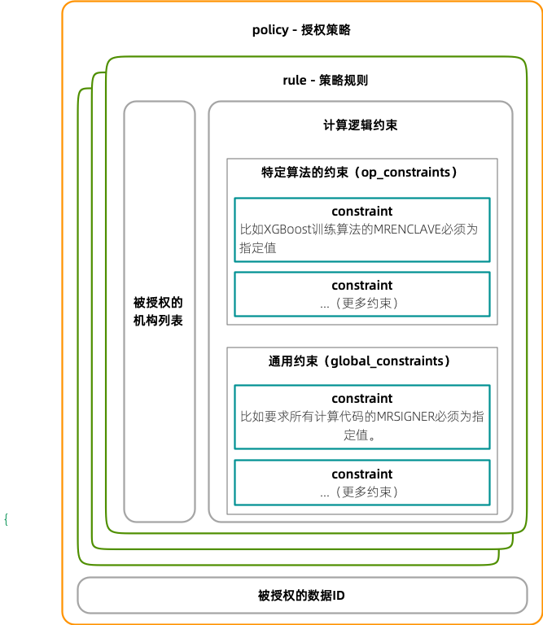

# 授权策略

TrustedFlow提供了一套简洁易懂的语法帮助用户对数据使用行为的授权进行描述。接下来我们会详细描述这套语法，并结合示例进行讲解。

## 授权策略概览

- `constraint`：约束表达式，描述了具体的数据使用行为约束。
- `rule`： 指具体的策略规则，rule本质上由一条或者多条约束表达式组成。
- `policy`：指作用于具体数据的授权策略，policy由一条或者多条rule组成。



## constraint
constraint本质上是描述“访问控制”这件事，比如允许对数据进行什么样的计算。

### 可限制的元信息
constraint支持对以下元信息进行限制。具体语法上，每一条constraint的元素都是以`r.`作为开头。（TrustedFlow采用了[casbin](https://github.com/casbin/casbin)作为底层的访问控制实现）

#### mr_enclave
限制代码的MRENCLAVE，关于MRENCLAVE的说明参见 [Enclave](./tee/sgx.md#enclave) 。

```yaml
r.env.tee.sgx.mr_encalve=="mrenclave of the enclave"
```

#### mr_signer
限制代码的MRSIGNER，关于MRSIGNER的说明参见 [Enclave](./tee/sgx.md#enclave) 。

```yaml
r.env.tee.sgx.mr_signer=="mrsigner of the enclave"
```

#### op
限制可以使用哪些[可信APP](./apps/index.rst)进行计算，需要配合rule一齐生效（具体参见后面的rule说明）。
目前可信APP对应的op名称为

- [数据求交](./apps/intersect.md): `OP_PSI`
- [数据随机切割](./apps/split.md): `OP_DATASET_SPLIT`
- [特征过滤](./apps/feature_filter.md): `OP_DATASET_FILTER`
- [全表统计](./apps/data_describe.md): `OP_TABLE_STATISTICS`
- [WOE分箱](./apps/woe_binning.md): `OP_WOE_BINNING`
- [WOE转换](./apps/woe_substitution.md): `OP_WOE_SUBSTITUTION`
- [相关系数矩阵](./apps/corr.md): `OP_STATS_CORR`
- [VIF](./apps/vif.md): `OP_LR`
- [LR训练](./apps/lr_train.md): `OP_WOE_SUBSTITUTION`
- [LR预测](./apps/lr_predict.md): `OP_PREDICT`
- [XGBoost训练](./apps/xgb_train.md): `OP_XGB`
- [XGBoost预测](./apps/xgb_train.md): `OP_PREDICT`
- [二分类评估](./apps/binary_evaluation.md): `OP_BICLASSIFIER_EVALUATION`
- [预测偏差评估](./apps/prediction_bias_eval.md): `OP_PREDICTION_BIAS_EVALUATION`

示例写法如下。
```yaml
# 表示限制仅能对数据执行XGBoost训练。
r.op=="OP_XGB"
```

#### （暂不可用）execution_time
限制执行时间。
```yaml
r.execution_time<="2023-10-01 23:59:59"
```

### 元素之间支持的操作符

用户可以根据需要对元信息进行操作，TrustedFlow支持的操符作如下。


## rule

### 成员说明
rule包含以下信息。

#### rule_id
每一条rule都会有一个ID用于标识它。

#### grantee_party_ids
列表形式，由被授权方的机构ID组成。

#### op_constraints
op_constraints表示作用于特定算法的约束，由一条或者多条op_constraint组成。op_constraint表示针对具体算子的约束，包含算子名称和一条或者多条constraint。
如果没有填写op_constraints，则表示不允许进行任何计算。

#### global_constraints
作用于全局的约束，由一条或者多条constraint组成。

#### （可选）columns
对于结构化数据，可以限定数据的哪些列可以被使用。

### 使用示例

下列rule描述了以下限制
1. 被授权方为bob和carol
2. 允许使用数据列f1、f2和f3
3. 限制XGB和LR的mrenclave
4. 限制所有代码的mrsigner

```json
{
    "rule_id":"test_rule_id",
    "grantee_party_ids":[
        "bob",
        "carol"
    ],
    "columns":[
        "f1",
        "f2",
        "f3"
    ],
    "op_constraints":[
        {
            "op_name":"OP_XGB",
            "constraints":[
                "r.op==\"OP_XGB\" && r.env.tee.sgx.mr_enclave==\"XGB_ENCLAVE\""
            ]
        },
        {
            "op_name":"OP_LR",
            "constraints":[
                "r.op==\"OP_LR\" && r.env.tee.sgx.mr_enclave==\"LR_ENCLAVE\""
            ]
        }
    ],
    "global_constraints":[
        "r.env.tee.sgx.mr_signer==\"MRSIGNER\""
    ]
}
```

## policy

`policy`描述了完整的授权策略。

### 成员说明

#### data_uuid
策略所作用于的数据id。

#### rules
由一条或者多条rule组成的列表。

### 示例
我们继续以上面rule的使用示例为例，一个完整的policy如下。

```json
{
    "data_uuid":"data id",
    "rules":[
        {
            "rule_id":"test_rule_id",
            "grantee_party_ids":[
                "bob",
                "carol"
            ],
            "columns":[
                "f1",
                "f2",
                "f3"
            ],
            "op_constraints":[
                {
                    "op_name":"OP_XGB",
                    "constraints":[
                        "r.op==\"OP_XGB\" && r.env.tee.sgx.mr_enclave==\"XGB_ENCLAVE\""
                    ]
                },
                {
                    "op_name":"OP_LR",
                    "constraints":[
                        "r.op==\"OP_LR\" && r.env.tee.sgx.mr_enclave==\"LR_ENCLAVE\""
                    ]
                }
            ],
            "global_constraints":[
                "r.env.tee.sgx.mr_signer==\"MRSIGNER\""
            ]
        }
    ]
}