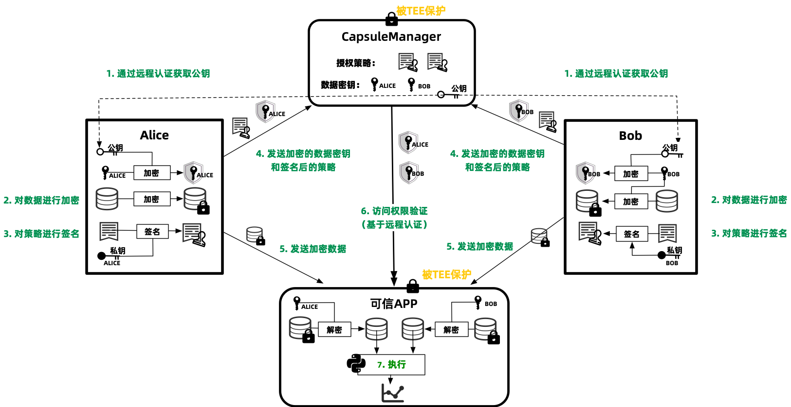

# TrustFlow原理

TrustFlow的核心原理如下图所示。主要流程描述如下。

1. 数据持有方（图中以alice和bob为例）对[CapsuleManager](https://github.com/asterinas/trustflow-capsule-manager)（运行在TEE中）进行远程认证，确认CapsuleManager被正确部署在TEE环境中，且代码未被篡改。CapsuleManager的公钥会随着远程认证报告一起返回给数据持有方。

2. 数据持有方生成数据加密密钥，对数据进行加密，并且使用CapsuleManager的公钥对加密密钥进行加密。

3. 数据持有方根据数据使用需求，生成授权策略，详见[授权策略](../quick_start/step3.ipynb)，策略文件使用持有方的私钥进行签名。

4. 数据持有方把加密后的数据密钥和签名后的授权策略文件发送给CapsuleManager。

5. 数据持有方把加密后的数据发送给数据加工方（提供TEE计算资源）。

6. 数据加工方启动可信APP（运行在TEE中），可信APP从CapsuleManager请求获取数据密钥。CapsuleManager会进行以下验证，验证通过后才会把数据密钥发送给可信APP，发送时使用可信APP的公钥加密以确保安全。

    (1) 对可信APP进行远程认证，确认可信APP运行在TEE环境中，且代码未被篡改。

    (2) 根据数据持有方设置的策略，检查可信APP是否在授权列表中。

    (3) 根据数据持有方设置的策略，检查计算参与方是否在授权列表中。比如图中carol执行可信APP使用了alice和bob的数据，仅当alice和bob的策略都允许carol执行计算才会通过。

    (4) 根据数据持有方的策略进行其他检查（取决于策略的具体设置）。

7. 可信APP使用私钥解密得到数据加密密钥，继而解密得到明文数据，并按照预设的计算逻辑对数据进行计算。

