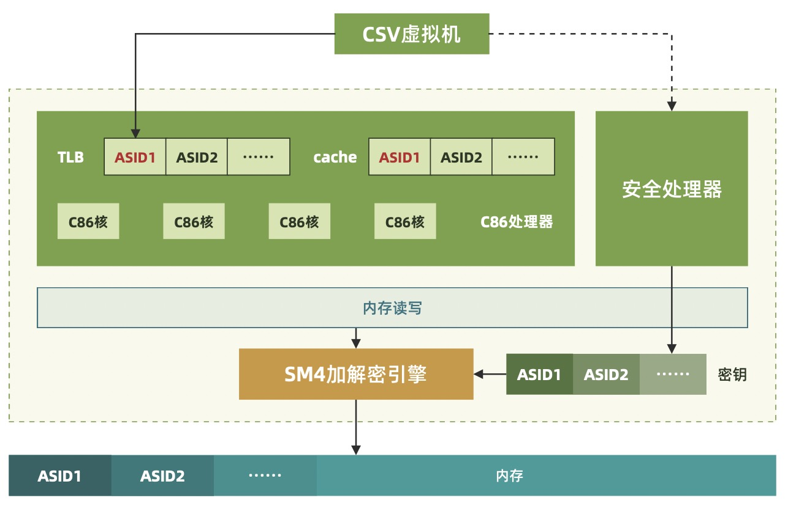

# 海光 CSV
海光CSV（China Secure Virtualization）是由海光自主研发的安全虚拟化技术，属于面向虚拟机的TEE方案。它采用国密算法实现，CSV虚拟机在写内存数据时CPU硬件自动加密，读内存数据时硬件自动解密，每个CSV虚拟机使用独立的密钥。海光CPU内部使用ASID（Address Space ID）区分不同的CSV虚拟机和主机，每个CSV虚拟机使用独立的Cache、TLB等CPU资源，实现CSV虚拟机、主机之间的资源隔离。CSV虚拟机使用隔离的硬件资源，支持启动度量、远程认证等功能，是一种安全的可信执行环境。

更多技术细节可以参见[Hygon Arch](https://openanolis.cn/sig/Hygon-Arch)