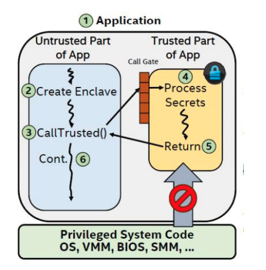
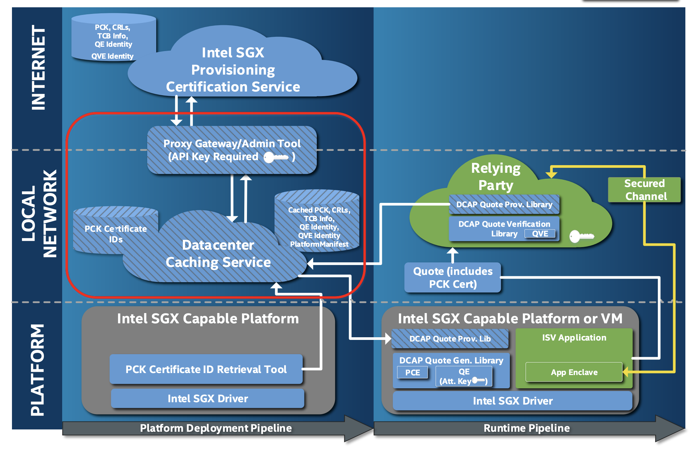

# Intel SGX

Intel SGX（Software Guard Extensions）是由Intel推出的一种TEE方案。SGX的安全模型是只信任CPU和微码。

## Enclave

SGX最重要的核心概念是Enclave（飞地），Enclave可以被视为进程中安全可信的部分，其中运行的程序和数据的机密性和完整性受到SGX的保护。Enclave所处的内存是加密的，除了Enclave自身和CPU之外， 其他系统软件包括 Operating system (OS), Virtual Machine Monitor (VMM), System Management Mode (SMM), BIOS等都无法访问 Enclave，从而避免 Enclave 被恶意攻击。

下图中黄色部分表示了Enclave。从图中我们可以看到，在标准的SGX模型下，应用被分为可信和不可信两部分，可信部分为 Enclave，
非可信部分为运行在外面的代码和数据。

关于Enclave的更详细介绍，可以阅读[SGX Enclave](https://www.intel.com/content/dam/develop/external/us/en/documents/overview-of-intel-sgx-enclave-637284.pdf).

### Enclave身份标识 - MRENCLAVE 和 MRSIGNER

每个Enclave都具有两个与其绑定的身份标识。

第一个是Enclave Identity（飞地身份），它由**MRENCLAVE**的值表示，MRENCLAVE是Enclave的度量值，度量了Enclave构建和初始化过程的每个步骤的加密哈希值。MRENCLAVE唯一标识任何特定的飞地。不同版本的飞地构建/版本将导致不同的MRENCLAVE值。

第二个是由授权机构提供的Signing Identity（签名身份），该机构在分发之前对enclave进行签名。该值称为**MRSIGNER**，对于所有使用相同授权机构签名的飞地，该值均是相同的。

根据场景的不同，您可以选择用MRENCLAVE或者MRSIGNER来唯一确认Enclave的身份，通常情况下应该使用MRENCLAVE。若您可以信任某个机构，则可以使用MRSIGNER，从而减缓使用中可能遇到的潜在问题，比如代码频繁升级带来的困扰。

## 远程认证

远程认证提供了一种机制，允许远程用户验证远程进程中软件的真实性。SGX的远程认证可以对以下内容进行验证：

1. Enclave运行在SGX内部

2. Enclave运行在具有最新安全级别的系统上

3. Enclave的代码

通过远程认证，用户可以确保enclave运行环境是可靠的，且运行的代码未被篡改。

目前SGX支持两种类型的远程认证：ECDSA（Elliptic Curve Digital Signature Algorithm）认证和 Intel EPID(Intel Enhanced Privacy ID) 认证，更详细说明参见[intel remote attestation](https://www.intel.com/content/www/us/en/developer/tools/software-guard-extensions/attestation-services.html)。SecretFlow目前仅支持ECDSA认证模式。

ECDSA配合 Intel SGX DCAP（Intel Software Guard Extensions Data Center Attestation Primitives）可以允许用户构建自己的认证服务，而不需要依赖intel的远程认证服务。intel提供了Provisioning Certification Caching Service (PCCS)来帮助用户完成这一目标。

（[图片来源](https://download.01.org/intel-sgx/sgx-dcap/1.10/linux/docs/SGX_DCAP_Caching_Service_Design_Guide.pdf)）

### 如何部署PCCS服务

#### 情形一：使用云厂商自带的PCCS服务
如果您购买的是云厂商的机器，则云厂商通常会默认提供PCCS服务。
比如您的服务器提供商是阿里云，则可参考[阿里云远程证明服务](https://www.alibabacloud.com/help/zh/ecs/user-guide/build-an-sgx-encrypted-computing-environment#section-utn-xc1-656)。

具体可以查阅对应云厂商的官方文档。

#### 自行搭建PCCS服务
如果您希望自行搭建PCCS服务，则可以参考[Intel PCCS](https://github.com/intel/SGXDataCenterAttestationPrimitives/tree/master/QuoteGeneration/pccs)。
