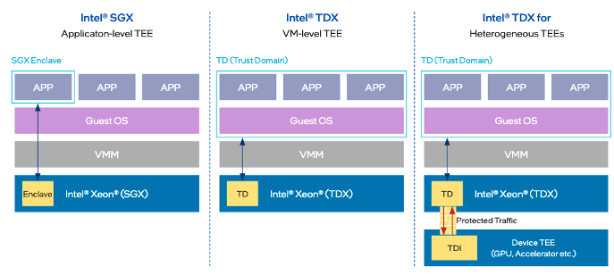
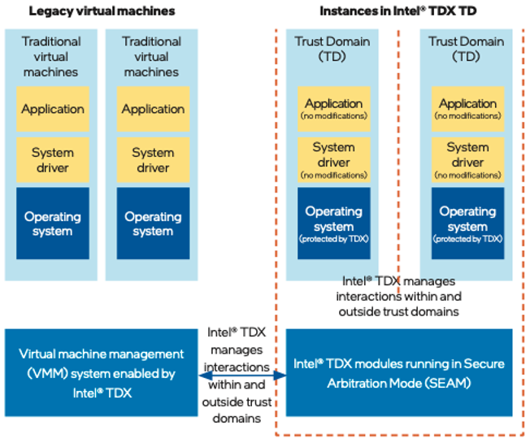

# Intel TDX

英特尔全新发布的第五代英特尔® 至强® 可扩展处理器内置英特尔®可信域（ Trust Domain Extension，TDX）技术，为客户提供面向虚拟化实例的机密计算新方案。英特尔® TDX提供了坚实的技术保障，助力客户在不改变现有应用程序的情况下，为其基础设施即服务（ Infrastructure as a Service， IaaS）和平台即服务（ Platform as a Service， PaaS）应用分别构建基于硬件设备的可信执行环境（ Trusted Execution Environment， TEE），如机密虚拟机或机密容器。同时，英特尔® TDX 技术使用便捷，客户能在云环境中大规模部署并实现实时迁移，拥有更灵活和友好的机密云计算环境。

## 英特尔®至强®可扩展处理器机密计算方案
作为机密计算技术的重要引领者，英特尔推出了两种基于硬件级别的安全保护技术：英特尔® 软件防护扩展 (Software Guard Extensions， SGX) 技术，提供软件级别的安全隔离保护；英特尔® 可信域（TDX）技术，提供虚拟化层级的安全隔离保护。凭借这两项内置的安全技术，第五代英特尔®至强®可扩展处理器能够提供全面的机密计算能力，助力云服务提供商能够在基于硬件的可信执行环境（TEE）中，提供IaaS、PaaS和SaaS应用服务。

此外，通过创建一个 “信任域（TD）”的虚拟机环境，英特尔®TDX将客户操作系统和虚拟机（VM）应用程序与云主机、系统管理程序以及同一平台的其他虚拟机隔离开来。阿里云在第八代企业级ECS实例中集成了英特尔®TDX，成为首家公有云服务提供商，在公有云中提供基于TD的机密实例和机密容器。英特尔®TDX为云上整个虚拟化实例（包括虚拟机和云原生容器）创建了一个可信赖的边界。因此，云终端用户可以创建一个机密计算环境，该环境将信任边界扩展到整个虚拟化实例，通过直接迁移（lift-and-shift），简化了传统应用程序向机密计算的迁移。

### 机密计算安全隔离
借助英特尔® 虚拟机扩展 (Intel® Virtual Machine Extension，英特尔® VMX) 技术与英特尔® 多密钥全内存加密(Intel® Multi-Key Total Memory Encryption，英特尔® MK-TME)技术，英特尔® TDX 为云实例提供了一种被称为“信任域 (Trust Domain， TD)”的全新虚拟访客环境。 TD 可与其它 TD、实例，以及底层系统软件、管理软件实现相互隔离。而这些安全策略的实施，是由运行在安全仲裁模式 (Secure-Arbitration Mode， SEAM) 下的 TDX 安全服务模块来完成。

###	加密内存数据流通性能优异
通过CPU处理器中集成在内存控制器（IMC）的内置内存加密引擎，英特尔®TDX帮助用户能够对传输中的敏感数据进行加密。这种方法消除了传统数据库在处理敏感计算时反复进行数据加密解密的额外开销。通过在基于英特尔®TDX的可信执行环境（TEE）中运行数据库操作引擎，当云数据库处理用户敏感数据时，数据的状态始终可以得到机密保护。

### 便于大规模部署
直接迁移（lift-and-shift）简化了复杂的数据库系统向机密计算的迁移。此外，英特尔®TDX还为超大规模部署提供了丰富的云操作能力，例如无服务中断的实时迁移和TCB升级。这些能力都降低了云上全密态数据库的操作和维护成本，提高了整体可用性。

更多技术细节可以参见[Intel TDX白皮书](https://www.intel.com/content/www/us/en/developer/tools/trust-domain-extensions/overview.html)。