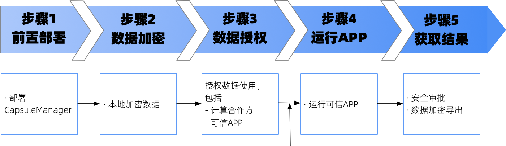

.. _quick_start:

快速上手
===============

欢迎使用TrustedFlow！

整个快速上手的使用流程如下图所示。

仿真模式与SGX模式
--------------------
为了方便用户上手体验，TrustedFlow提供仿真模式，用户可以在没有TEE硬件的情况下体验TrustedFlow的基本功能。
需要注意的是，仿真模式没有TEE安全特性，因此仅限于体验使用，请勿在生产中使用仿真模式。

如果用户有真实的TEE机器，则可以尝试SGX模式执行（目前TrustedFlow仅支持SGX2，未来会支持更多TEE硬件）。

参与机构
----------
为了方便后续演示，我们假设有三个机构分别为alice、bob和carol，其中alice和bob提供数据，carol提供TEE机器。
每个机构的职责不同，后续会有相应说明。

注意，我们并不限定TEE机器必须是第三方（carol）提供，亦可以是alice或者bob自身，这里以carol提供TEE机器为例是为了方便进行说明。

机构证书
---------
后续的演示依赖每个机构提供证书和私钥。为了方便测试，可以用以下命令为每个机构生成一个自签的证书。
**注意，自签证书仅适用于测试，请勿直接用于生产**

1. alice生成私钥，私钥文件名为alice.key

::

   openssl genrsa -out alice.key 3072

2. alice自签发证书，证书文件名为alice.crt。

::
   
   openssl req -x509 -new -nodes -key alice.key -sha256 -days 3650 -out alice.crt

3. bob、carol用相同方式生成自签证书，记得修改产出文件的名称。

详细步骤
------------

.. toctree::
   :maxdepth: 2

   step1
   step2
   step3
   step4
   step5

